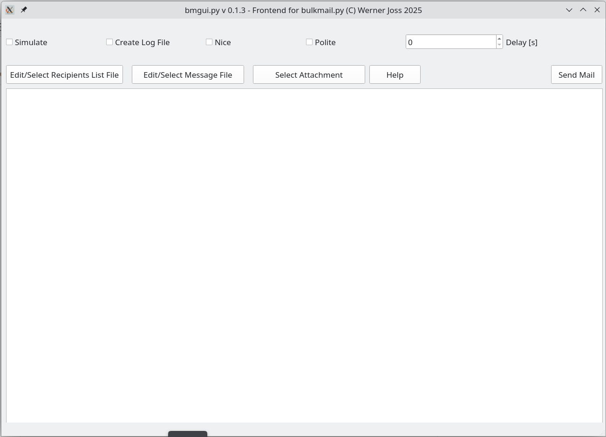

## bulkmail.py: send bulk email to recipients in RecListFileName

This is an improved Version from this [original gist](https://gist.github.com/wernerjoss/9ba0d815bb91d043f929d98670f99064)
As an Addition to the CLI Version, it also has a GUI Frontend, written with PyQt5:

## Usage:
The CLI Version, bulkmail.py, is the core function of this Program.  
It takes the Recipient File Name and the Message File Name as mandatory Arguments, others for Simulation (Test before actual sending!),
Logfile creation, Nice Title and Attachment (File) are optional.  
Configuration (SMTP Server, Sender Credentials) is (currently) inside the source code and must be adapted to your needs before actual use.  
bulkmail.yp should be stored somwhere in your PATH, e.g. /usr/local/bin .  
The same applies for the GUI Frontend bmgui.py.
Be sure to provide the Recipints List File in the correct Format !  
(each Line holds Fist Name, blank, Last Name, blank, <email address> - empty Lines or Lines beginning with # are ignored).

## Hints:
Message sent is from MsgFileName, preceeded by 'Hallo <Name>,\n'  
RecListFileName must contain one Recipient per line in the form 'Vorname Name <email>'	note: surrounding <> for email Adress is required !  
Default Subject should be overridden in MsgFile (1st line starting with 'Subject:')  

## (Old) Changelog for CLI Version:
this can send messages with utf-8 encoding, not just ascii (as bulkmail_asc.py) 30.04.17  
add max No of Msgs sent per run (SPAM Protection) 10.03.18  
guess gender :) - see https://pypi.python.org/pypi/gender-detector 10.03.18 - replaced by gender_guesser: https://pypi.org/project/gender-guesser/ 02/2020   
getopt Argument Parser 11.03.18  
add Attach File Option 11.03.18  
fix some bugs 18.03.18  

## TODO:
- enable optional encryption for recipients from local keyring